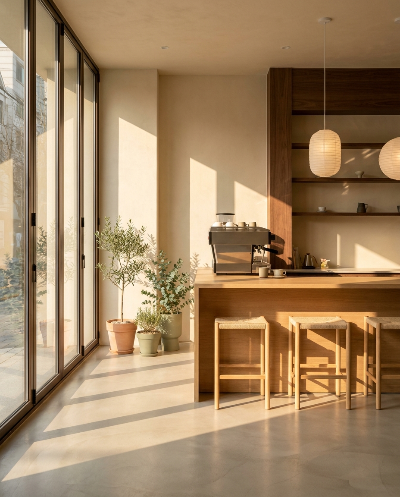
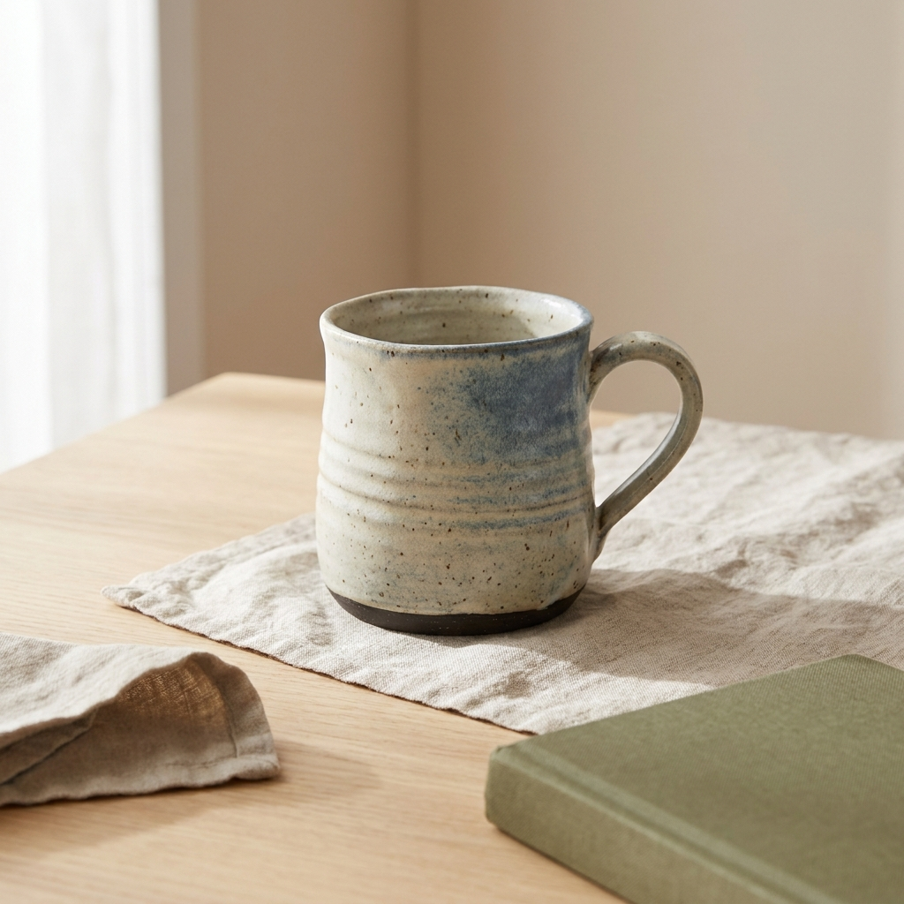

# reelforge

레퍼런스를 먼저 보고, 장르에 맞는 모델을 골라, 스스로 채점하며 다시 만드는
이미지 생성 파이프라인.

터미널의 **Claude Code / Codex CLI 가 오케스트레이터**다.
Gemini·Higgsfield 는 그 밑에서 이미지를 만드는 도구고,
`viewer/index.html` 은 결과를 보는 대시보드다.

```
사용자 ──▶ Claude Code / Codex ──┬─▶ scripts/rf.py ──▶ Pinterest (레퍼런스)
                                 │                └─▶ Gemini API (생성)
                                 └─▶ Higgsfield MCP (생성·업스케일)
                                        │
                                   runs/<slug>/ ──▶ viewer/index.html
```

## 왜 이렇게 만들었나

프롬프트 한 줄 던져서 나온 이미지는 대체로 평범하다. 사람이 잘 만들 때 하는 일은
따로 있다 — 레퍼런스를 먼저 찾아보고, 뭘 만드는지에 따라 도구를 바꾸고,
나온 걸 보고 다시 만든다. 그 절차를 그대로 자동화했다.

## 시작

```bash
# 1. 생성 백엔드 하나는 있어야 한다
echo 'GEMINI_API_KEY=...' > .env   # https://aistudio.google.com/apikey (.env 는 gitignore)

# 2. Claude Code 를 이 폴더에서 띄우고 그냥 말한다
claude
> 홍대 감성 카페 인테리어 이미지 만들어줘, 인스타 피드용
```

에이전트가 알아서 9단계를 돈다. 직접 돌리려면:

```bash
./scripts/rf.py new cafe --request "홍대 감성 카페" --aspect 4:5
./scripts/rf.py refs cafe --query "warm minimal cafe interior daylight" --genre architecture -n 10
./scripts/rf.py route cafe --genre architecture
./scripts/rf.py gen cafe --prompt-file runs/cafe/prompt-01.txt
./scripts/rf.py index && open viewer/index.html
```

## 실제 결과

세 장르를 같은 파이프라인으로 돌린 것. 프롬프트는 장르별 템플릿에서 나왔고,
점수는 파이프라인이 결과물을 직접 보고 매긴 것이다.

| | | |
|---|---|---|
|  |  |  |
| `architecture` · 89점 | `product` · 92점 | `typography_poster` · 95점 |
| "홍대 감성 카페 인테리어" | "핸드메이드 세라믹 머그 썸네일" | "재즈 바 포스터, MIDNIGHT SET" |

포스터의 세 줄(`MIDNIGHT SET` / `LIVE AT THE BLUE ROOM` / `FRIDAY 11PM`)이
전부 정확히 나온 건 우연이 아니라 `typography_poster` 템플릿이 헤드라인을
따옴표로 고정하고 네거티브에 철자 오류를 넣기 때문이다.

## 9단계

| # | 단계 | 하는 일 |
|---|---|---|
| 1 | brief | 요청을 주제·용도·비율·분위기로 정규화 |
| 2 | genre | 12개 장르 중 하나로 분류 |
| 3 | reference | 핀터레스트에서 레퍼런스 10장 수집 |
| 4 | moodboard | 레퍼런스를 실제로 보고 팔레트·조명·구도 추출 |
| 5 | route | 장르 → 그 장르를 잘하는 모델 선택 |
| 6 | prompt | 장르별 검증된 템플릿을 무드보드로 채움 |
| 7 | generate | 이미지 생성 |
| 8 | critique | 결과물을 실제로 보고 0~100 채점 |
| 9 | refine | 80점 미만이면 고쳐서 재생성 (최대 3회) |

## 장르 라우팅

Kling 이 하는 방식 — 뭘 만드는지에 따라 다른 모델을 쓴다.
`config/routing.yaml` 한 파일에 다 들어있고, 사람이 고치라고 만든 파일이다.

인물 `soul_2` · 시네마틱 `cinematic_studio_2_5` · 제품 `marketing_studio_image` ·
음식 `kling_omni_image` · 풍경 `soul_location` · 건축 `nano_banana_pro` ·
애니 `seedream_v4_5` · 컨셉아트 `soul_cinematic` · 타이포 `openai_hazel` ·
로고 `recraft_v4_1` · 다이어그램 `nano_banana_pro` · 일반 `nano_banana_pro`

## 문서

- [AGENTS.md](AGENTS.md) — 에이전트 운영 규칙
- [docs/superpowers/specs/2026-09-06-reelforge-image-pipeline-design.md](docs/superpowers/specs/2026-09-06-reelforge-image-pipeline-design.md) — 설계
- [docs/planning.md](docs/planning.md) — 초기 기획 메모
