# reelforge

레퍼런스를 먼저 보고, 장르에 맞는 모델을 골라, 스스로 채점하며 다시 만드는
이미지 생성 파이프라인.

터미널의 **Claude Code / Codex CLI 가 오케스트레이터**다.
Gemini·Higgsfield 는 그 밑에서 이미지를 만드는 도구고,
`viewer/index.html` 은 결과를 보는 대시보드다.

```
사용자 ──▶ Claude Code / Codex ──┬─▶ scripts/rf.py ──▶ Pinterest (레퍼런스)
                                 │                └─▶ Gemini API (생성)
                                 └─▶ Higgsfield MCP (생성·업스케일)
                                        │
                                   runs/<slug>/ ──▶ viewer/index.html
```

## 왜 이렇게 만들었나

프롬프트 한 줄 던져서 나온 이미지는 대체로 평범하다. 사람이 잘 만들 때 하는 일은
따로 있다 — 레퍼런스를 먼저 찾아보고, 뭘 만드는지에 따라 도구를 바꾸고,
나온 걸 보고 다시 만든다. 그 절차를 그대로 자동화했다.

## 시작

```bash
# 1. 생성 백엔드 하나는 있어야 한다
echo 'GEMINI_API_KEY=...' > .env   # https://aistudio.google.com/apikey (.env 는 gitignore)

# 2. Claude Code 를 이 폴더에서 띄우고 그냥 말한다
claude
> 홍대 감성 카페 인테리어 이미지 만들어줘, 인스타 피드용
```

에이전트가 알아서 9단계를 돈다. 직접 돌리려면:

```bash
./scripts/rf.py new cafe --request "홍대 감성 카페" --aspect 4:5
./scripts/rf.py refs cafe --query "warm minimal cafe interior daylight" --genre architecture -n 10
./scripts/rf.py route cafe --genre architecture
./scripts/rf.py gen cafe --prompt-file runs/cafe/prompt-01.txt
./scripts/rf.py index && open viewer/index.html
```

## 실제 결과

12개 장르 전체를 같은 파이프라인으로 23회 돌렸다. 프롬프트는 장르별 템플릿에서
나왔고, 점수는 파이프라인이 결과물을 직접 보고 매긴 것이다.

| | | |
|---|---|---|
| 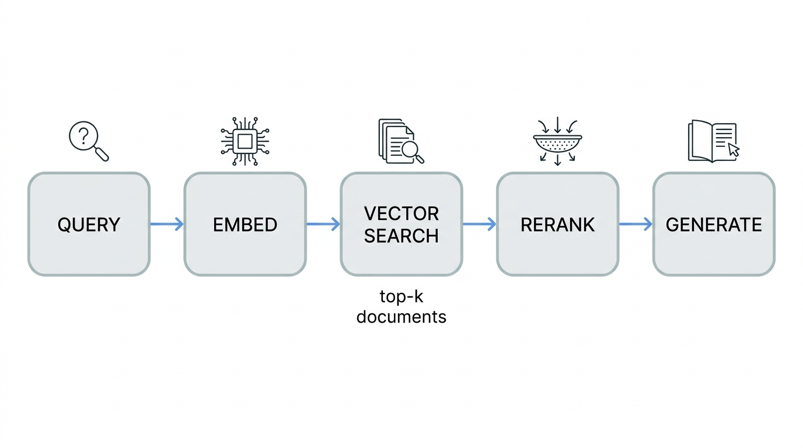 | 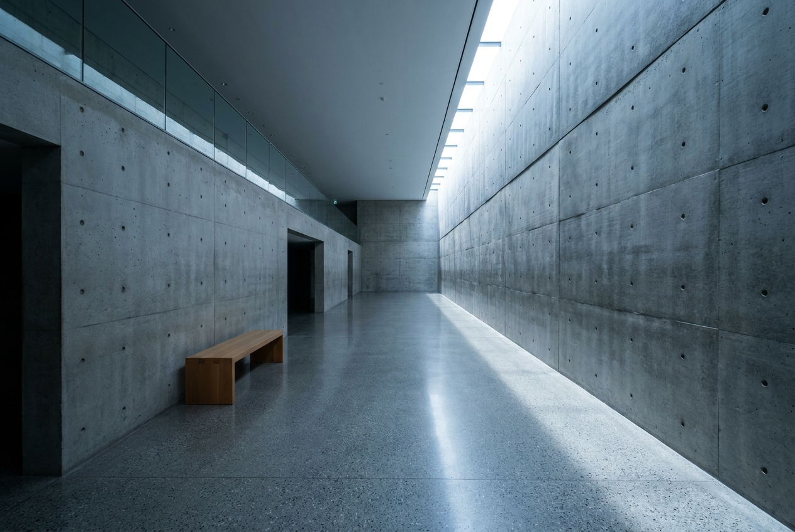 | 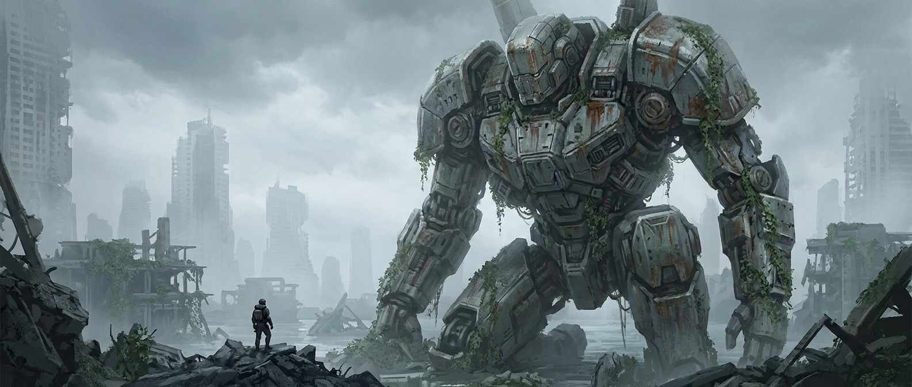 |
| `diagram` · **97** | `architecture` · **96** | `concept_art` · **96** |
|  | 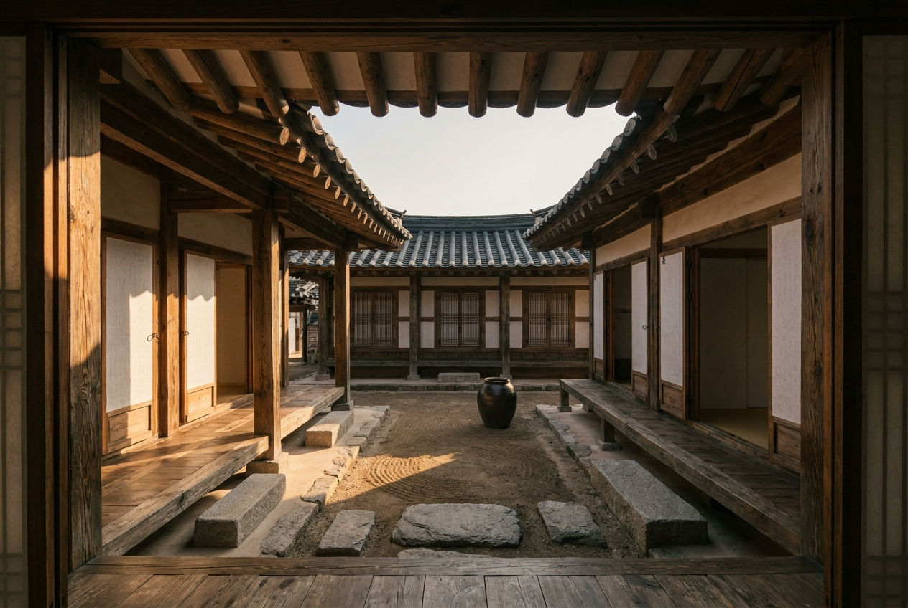 | 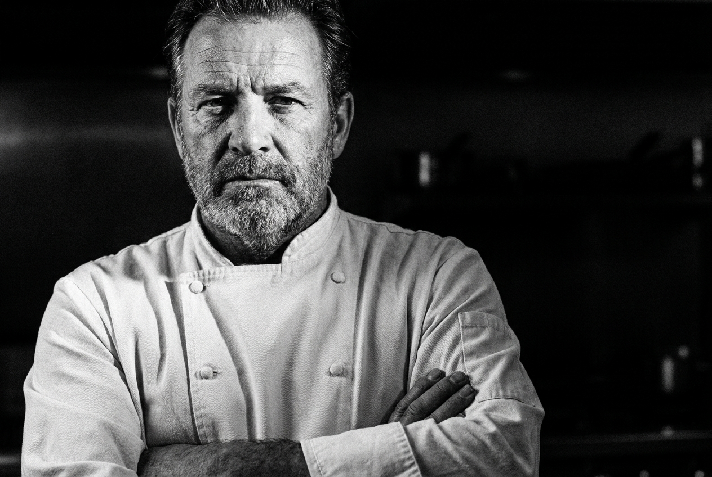 |
| `landscape` · **96** | `architecture` · **95** | `portrait` · **95** |
| 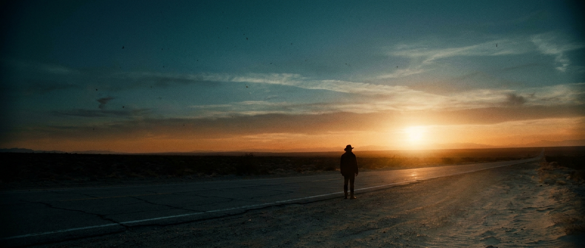 | 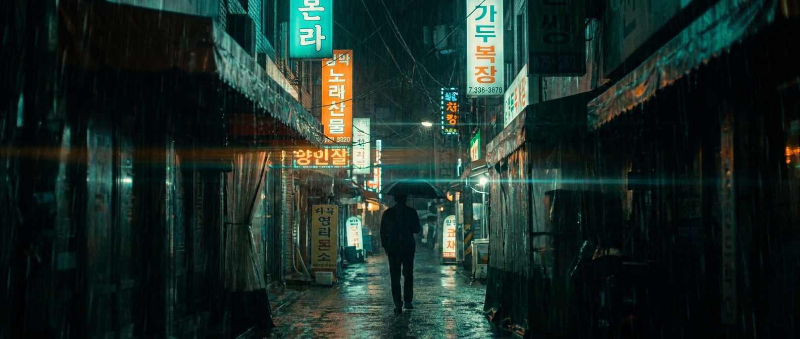 | 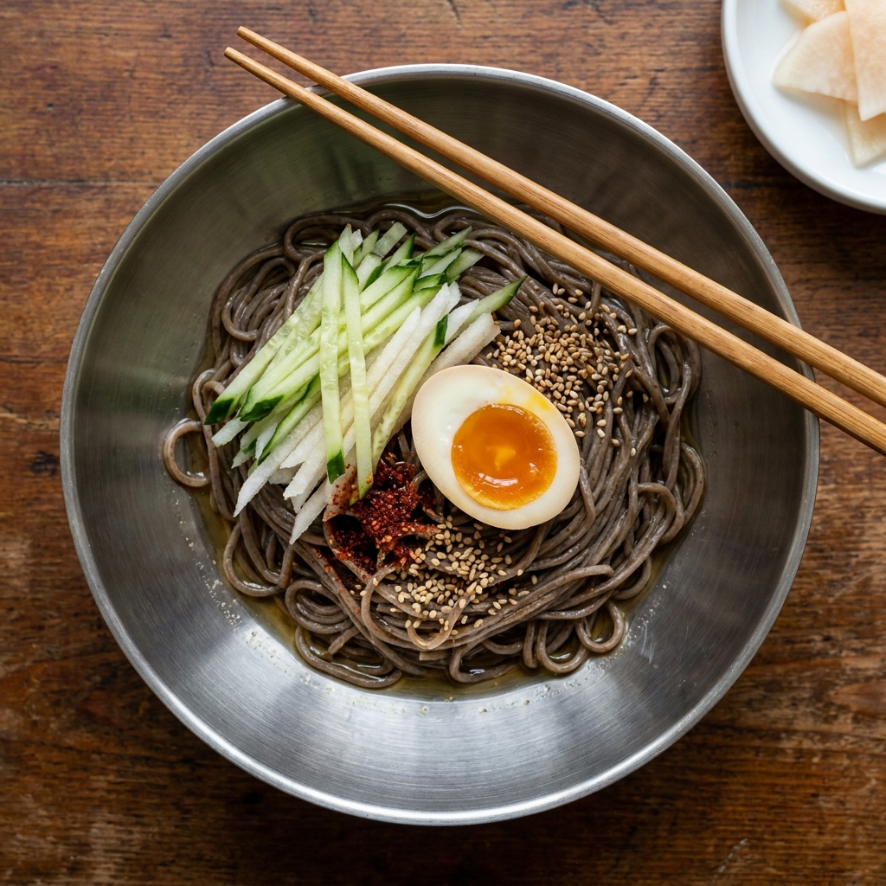 |
| `cinematic_still` · **95** | `cinematic_still` · **92** | `food` · **93** |
| 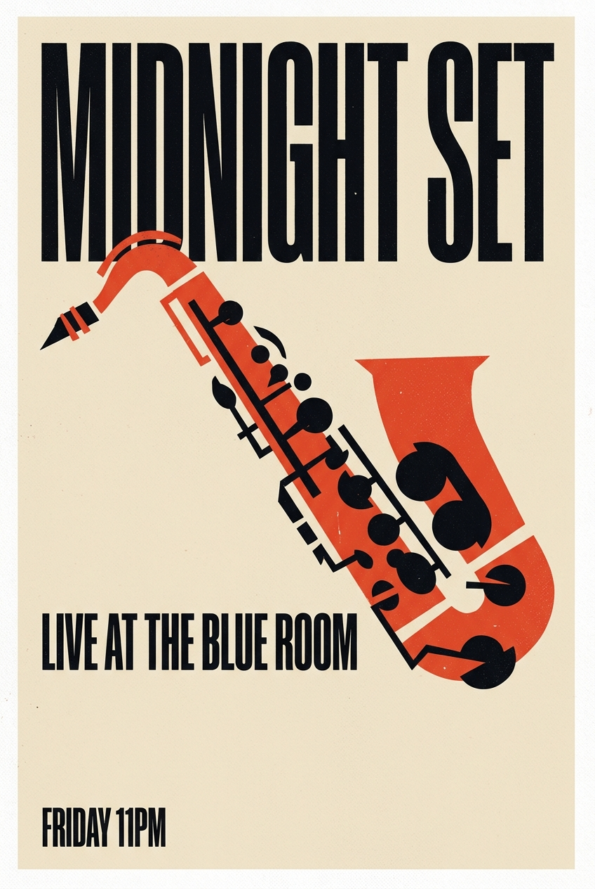 | 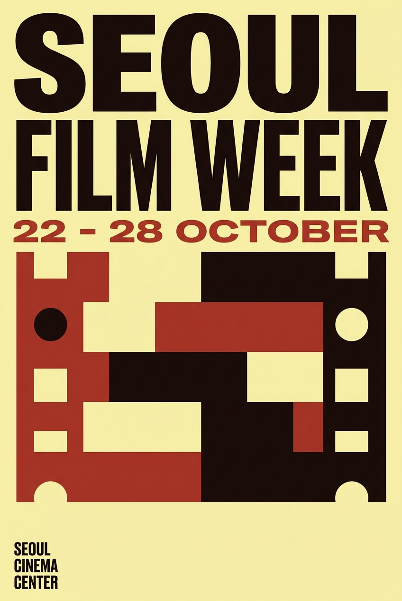 | 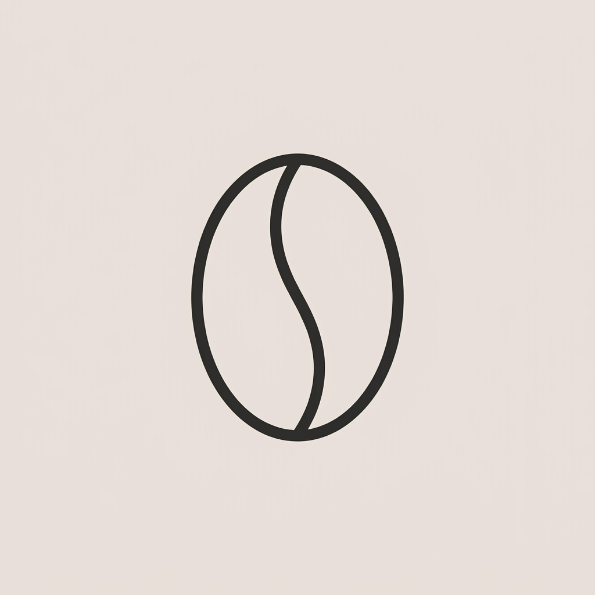 |
| `typography_poster` · **95** | `typography_poster` · **91** | `logo_icon` · **93** (2차) |

**1차 평균 91.1 · 재생성 후 93.1 · 23런 전부 임계값 통과.**

### 재생성 루프가 실제로 한 일

23런 중 2건이 1차에서 80점을 못 넘겼고, 파이프라인이 원인을 짚어 프롬프트를
고친 뒤 다시 만들었다.

| | 1차 | 진단 | 2차 |
|---|---|---|---|
| `logo_icon` | **72** — 콩도 김도 아닌 정체불명 도형 | "콩이면서 동시에 김"이라는 이중 의미 요구가 형태를 무너뜨림. 의미를 하나로 줄이고 획을 셋으로 제한 | **93** |
| `product` | **70** — 액자 속 액자가 생김 | 배경색으로 준 midnight blue를 테두리로 해석. 배경색 지정을 빼고 full-bleed 명시 | **95** |

이건 사람이 개입한 게 아니라 8단계 `critique` 가 이미지를 보고 적어둔
`fix` 를 9단계가 그대로 반영한 결과다.

### 텍스트가 살아남는 이유

`typography_poster` 와 `diagram` 은 생성 이미지가 가장 잘 망가지는 장르다.
그런데 두 포스터의 여섯 줄(`MIDNIGHT SET` / `LIVE AT THE BLUE ROOM` / `FRIDAY 11PM` /
`SEOUL FILM WEEK` / `22 - 28 OCTOBER` / `SEOUL CINEMA CENTER`)과 다이어그램의
라벨 여섯 개가 전부 정확히 나왔다. 우연이 아니라 해당 템플릿이 문구를 따옴표로
고정하고 네거티브에 철자 오류를 넣기 때문이다.

### 영상

이미지가 통과한 뒤에만 움직인다. 최종 스틸을 첫 프레임으로 써서 Veo 3.1로
image-to-video. 장르마다 어울리는 카메라 무브가 `config/routing.yaml` 의
`video.motion` 에 한 줄씩 들어있다.

https://github.com/lsmman/reelforge/raw/main/docs/examples/neon-alley.mp4

`cinematic_still` · 88점 · 8초 · 느린 돌리인. 스틸의 색과 비, 네온 반사가
유지된 채 인물이 멀어진다.

## 9단계

| # | 단계 | 하는 일 |
|---|---|---|
| 1 | brief | 요청을 주제·용도·비율·분위기로 정규화 |
| 2 | genre | 12개 장르 중 하나로 분류 |
| 3 | reference | 핀터레스트에서 레퍼런스 10장 수집 |
| 4 | moodboard | 레퍼런스를 실제로 보고 팔레트·조명·구도 추출 |
| 5 | route | 장르 → 그 장르를 잘하는 모델 선택 |
| 6 | prompt | 장르별 검증된 템플릿을 무드보드로 채움 |
| 7 | generate | 이미지 생성 |
| 8 | critique | 결과물을 실제로 보고 0~100 채점 |
| 9 | refine | 80점 미만이면 고쳐서 재생성 (최대 3회) |

영상까지 원할 때만 이어서:

| # | 단계 | 하는 일 |
|---|---|---|
| 10 | motion | 장르별 카메라 무브 결정 |
| 11 | animate | 최종 이미지를 첫 프레임으로 image-to-video |
| 12 | critique | 프레임을 뽑아 실제로 보고 채점 |

## v2 — 외부 조사로 올린 성능

구글의 Gemini 이미지 모델 가이드와 Nano Banana Pro 프롬프팅 문서를 뒤져
v1이 틀리게 하고 있던 것 네 가지를 찾았다. 전부 근거를 API로 실측한 뒤 반영했다.

| 발견 | v1이 하던 것 | v2 |
|---|---|---|
| **Gemini에는 네거티브 프롬프트가 없다** | 장르마다 `negative:` 를 두고 "Avoid: misspelled text…" 를 덧붙임 | 같은 실패를 **긍정문** `guardrails:` 로 서술. 부정문은 그 개념을 프롬프트에 심는 꼴 |
| **레퍼런스를 직접 넣을 수 있다** | 핀터레스트 10장을 모아 **텍스트 묘사로만** 사용 | 3장을 **역할 지정해** 요청에 첨부 (A는 조명만, B는 팔레트만, C는 구도만) |
| **`imageSize` 기본값이 1K** | 파라미터를 안 보내 전부 1K | 기본 2K, 인쇄물은 `--size 4K` |
| **태그 나열보다 브리프 문장** | `Materials: … Lighting: …` 키워드 목록 | 크리에이티브 디렉터가 쓰는 문장형 템플릿 |

### 실제로 얼마나 올랐나

기존 23런에서 점수가 가장 낮았던 4건을 v2로 다시 돌렸다. 프롬프트의 의도는
그대로 두고 형식만 v2 규칙으로 바꿨다.

| 런 | v1 | v2 | 달라진 점 |
|---|---:|---:|---|
| `anime_illustration` | 87 | **93** | 실종됐던 2단 셀 셰이딩이 들어옴 |
| `product` | 88 | **94** | 배경·제품 톤 분리, 제품이 프레임의 3/4 |
| `portrait` | 90 | **95** | 나이대·크롭·림라이트 모두 교정 |
| `typography_poster` | 91 | **93** | 중앙 그래픽이 필름 스트립으로 읽힘 |

**평균 89.0 → 93.8.** 전체 23런 최종 평균은 94.0.

| v1 | v2 |
|---|---|
| 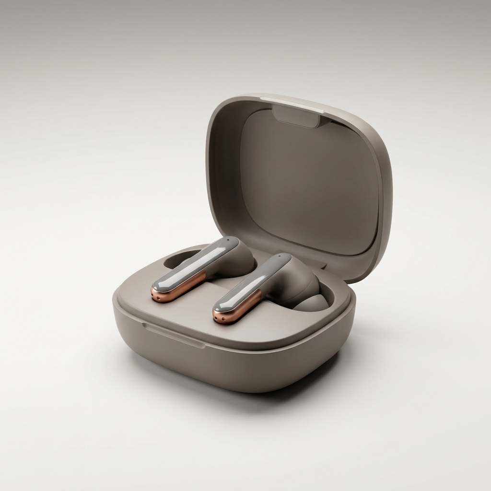 | 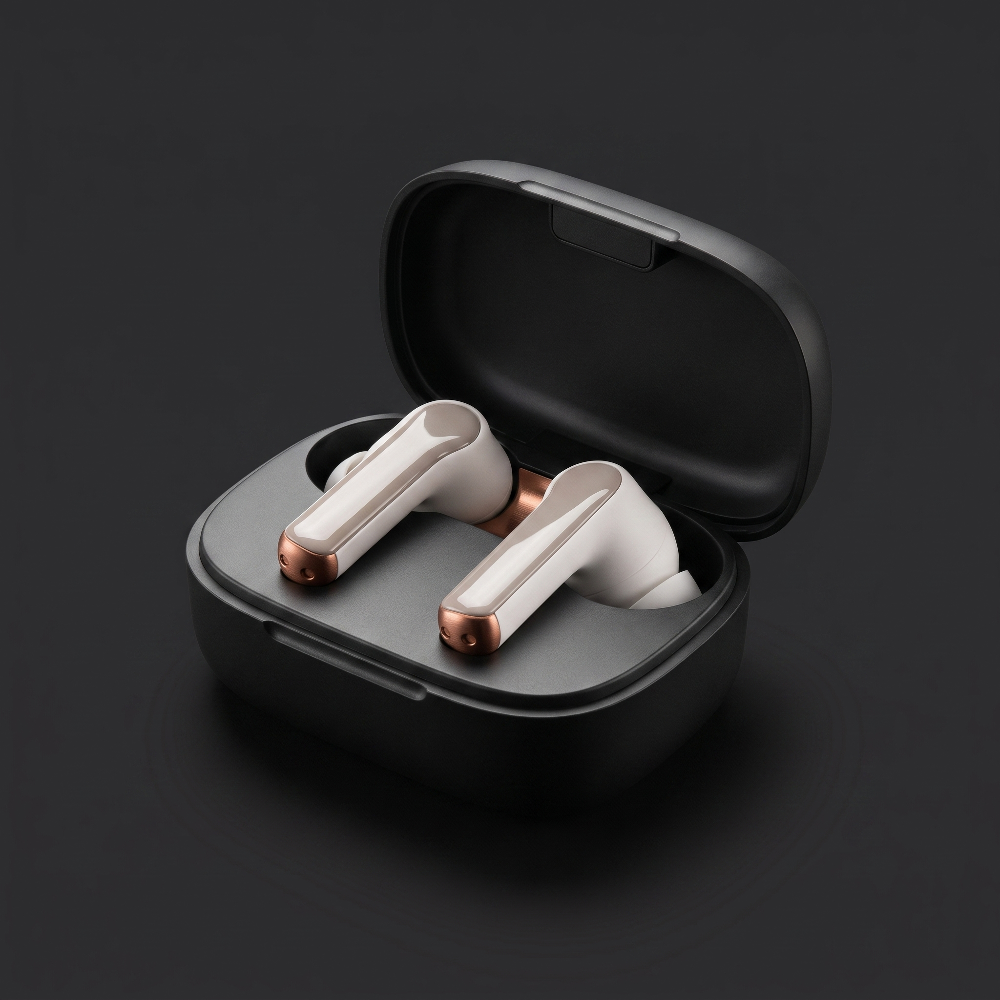 |
| 88 — 배경과 제품이 같은 베이지라 엣지가 죽고, 제품이 작아 썸네일에서 뭉갬 | **94** — 배경이 여러 스톱 어두워 무광·유광·금속이 각각 읽힌다 |
| 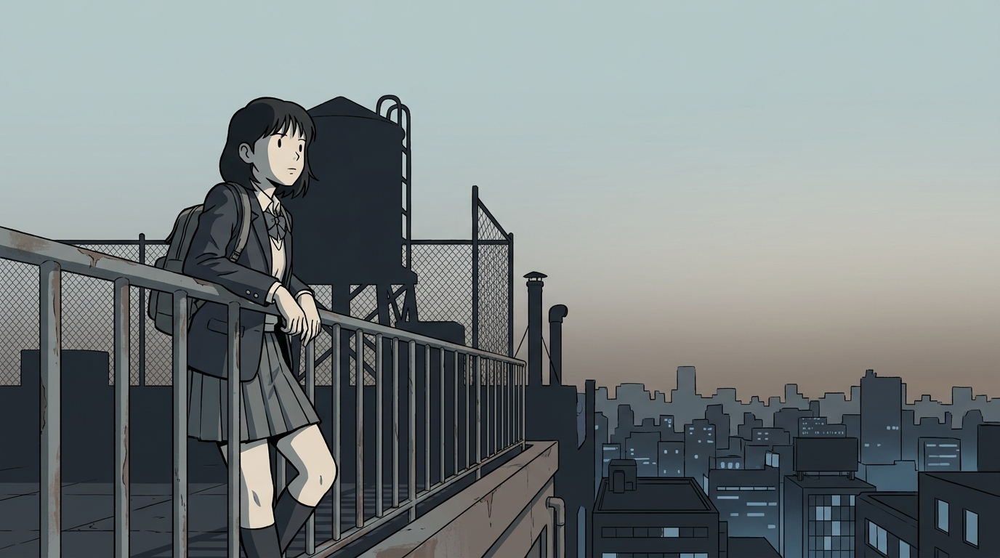 | 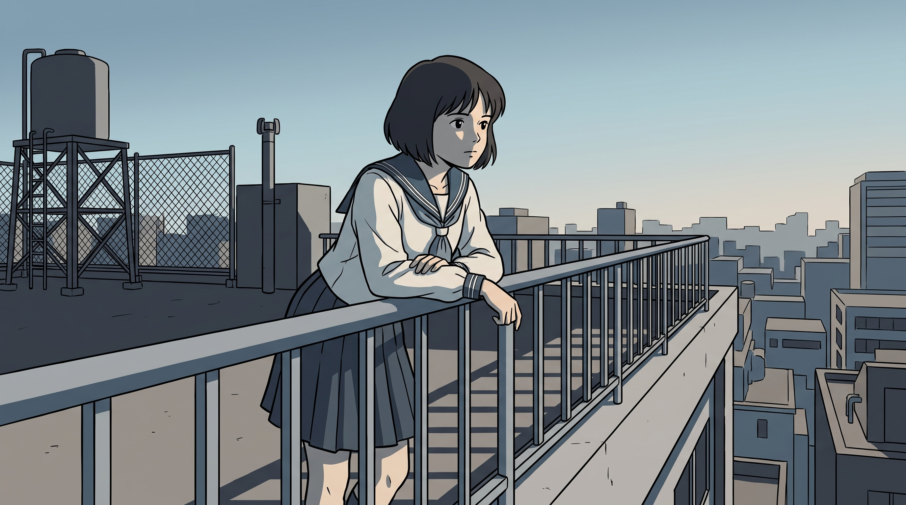 |
| 87 — 음영 없는 현대 벡터 일러스트. 셀 애니 지시가 안 먹음 | **93** — 얼굴 터미네이터, 치마 언더섀도, 난간 그림자 |

## 장르 라우팅

Kling 이 하는 방식 — 뭘 만드는지에 따라 다른 모델을 쓴다.
`config/routing.yaml` 한 파일에 다 들어있고, 사람이 고치라고 만든 파일이다.

인물 `soul_2` · 시네마틱 `cinematic_studio_2_5` · 제품 `marketing_studio_image` ·
음식 `kling_omni_image` · 풍경 `soul_location` · 건축 `nano_banana_pro` ·
애니 `seedream_v4_5` · 컨셉아트 `soul_cinematic` · 타이포 `openai_hazel` ·
로고 `recraft_v4_1` · 다이어그램 `nano_banana_pro` · 일반 `nano_banana_pro`

`guardrails` 는 부정문이 아니라 긍정문이다. `ref_roles` 는 레퍼런스 이미지에
붙일 역할이고, 장르마다 훔쳐야 할 것이 달라서 내용도 다르다.

영상도 같은 발상이다. `video.motion` 에 장르별 기본 카메라 무브가 한 줄씩 있다 —
인물은 거의 정지, 시네마틱은 느린 트래킹, 타이포·로고·다이어그램은 움직이지 않는다.

## 테스트

```bash
python3 scripts/test_rf.py
```

## 문서

- [AGENTS.md](AGENTS.md) — 에이전트 운영 규칙
- [docs/superpowers/specs/2026-09-06-reelforge-image-pipeline-design.md](docs/superpowers/specs/2026-09-06-reelforge-image-pipeline-design.md) — 설계
- [docs/planning.md](docs/planning.md) — 초기 기획 메모
